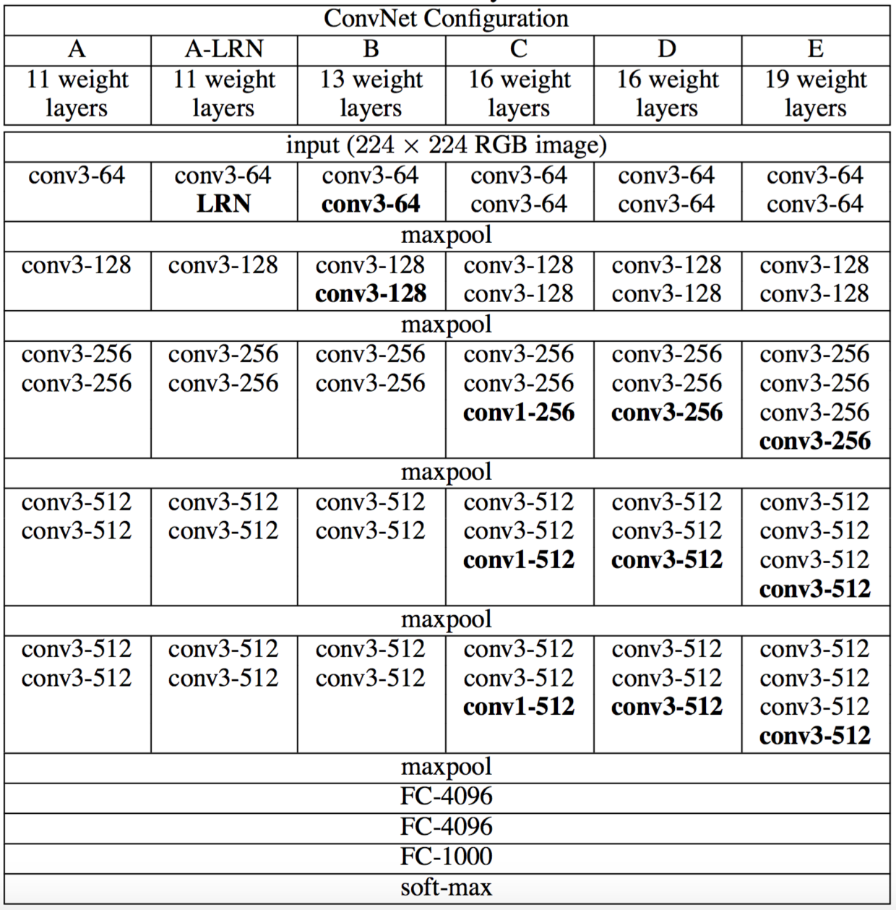

# one-hot-encoding-of-words-or-characters
https://github.com/fchollet/deep-learning-models/releases/download/v0.1/resnet50_weights_tf_dim_ordering_tf_kernels.h5

# [VGG16 ](http://blog.csdn.net/quincuntial/article/details/77386778)&[VGG19](https://www.jianshu.com/p/9d6082068f53)
## architecture
### Input_size: 224 x 224 x 3 (RGB图像)
### preprocess: minus the mean value on the total training set.
### convolution filter: 3 x 3
### padding: same
### maxpooling: 2 x 2
### last three Fully-Connected layers: 4096, 4096, 1000 
### Activation function: relu
## ConvNet Configuration:
### ConvNet Configuration:
每一列是一个网络，网络通道数都是从开始的64，最后增加到512。网络通道数每次都是在maxpool后增加二倍。
### the common network architecture
### VGG16: 2-2-3-3-3-fc x 3   
### VGG19: 2-2-4-4-4-fc x 3
## Discussion:
### 两个3x3的卷积等同于一个5x5的卷积，三个3x3等同于一个7x7的卷积，这样比单纯的使用一个5x5和7x7的卷积相比，增加了非线性修正层（relu），这使得决策函数更具判别性；同时也减少了参数数量。
## Training：
### 基于mini-batch 梯度下降法进行训练，mini-batch=256，momentum=0.9，weight decay=5*10（-4），learning rate=0.02，当验证集精度停止改善后学习率降低10倍，总共降低了三次，epoch=74
## 权值初始化：首先训练随机初始化的浅层网络结构A，之后将结构A的权值初始化给更深的网络结构的前四个卷积层和后面的三个全连接层，其他的层随机初始化（均值为0，方差为0.01的正态分布）
## 训练图像：训练图像进行了随机水平翻转和RGB颜色偏移（？）并归一化裁剪成224x224。训练过程中设置了训练尺度S，S为不小于224的值，一种是修正单尺度S，采用了两种尺度256和384，从固定边裁剪出224；另一种是在256和512之间随机采样S进行裁剪这相当于是增加了多尺度训练。
##测试：这涉及到单尺度，多尺度，多裁剪图像，多卷积网络融合，但是融合技巧没弄懂。

